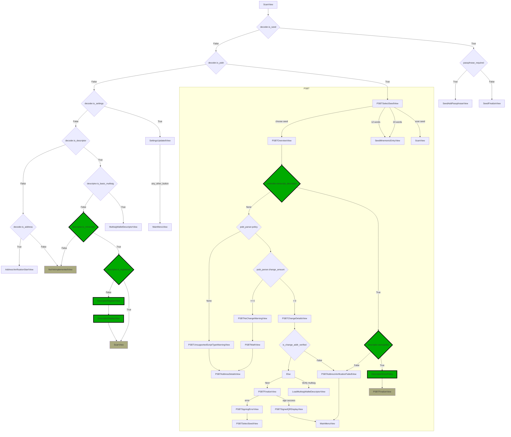

### ScanView

```mermaid
flowchart TB
    classDef add fill:#00aa00, stroke:#000000,stroke-width:4px;
    classDef modify fill:#aaaa7f;
    
    
    A[ScanView] --> T1{decoder.is_seed}
    T1 -- False --> T2{decoder.is_psbt}
    T2 -- False --> T3{decoder.is_settings}
    T3 -- False --> T4{decoder.is_descriptor}
    T4 -- False --> T5{decoder.is_address}
    T5 -- True --> V50[AddressVerificationStartView]
    T5 -- False --> V99[NotYetImplementedView]
    
    T1 -- True --> T10{passphrase_required}
    T10 -- True --> V10[SeedAddPassphraseView]
    T10 -- False --> V11[SeedFinalizeView]
    
    T3 -- True --> V30[SettingsUpdatedView]
    V30 -- any_other_button ---> V32[MainMenuView]


    
    T4 -- True --> T40{descriptor.is_basic_multisig}
    T40 -- False --> T41{descriptor.is_miniscript} -- False --> V99[NotYetImplementedView]
    T41:::add -- True --> T42{descriptor.is_registered} 
    T42:::add -- False --> V43[DescriptorRegisterView]
    V43:::add
    V43 --> V44[DescriptorDisplayView] --> AAA
    V44:::add
    T42 -- True --> AAA[ScanView]
    AAA:::modify

    V99:::modify
    T40 -- True --> V42[MultisigWalletDescriptorView]
    
    T2 -- True --> V20[PSBTSelectSeedView]
    
    subgraph PSBT


    V20 -- "choose seed" --> V21[PSBTOverviewView]
    V20 -- "12 words" --> V22[SeedMnemonicEntryView]
    V20 -- "24 words" --> V22[SeedMnemonicEntryView]
    V20 -- "scan seed" --> AA[ScanView]
    
    V21 --> T200{controller.miniscript_descriptor} -- None --> T20
    T200:::add -- True --> T201{"descriptor.owns(psbt)"} -- False --> V216
    T201:::add
    V202:::add
    T201 -- True --> V202[DescriptorShowPolicy] --> V2000[PSBTFinalizeView]
    V2000:::modify
    
    T20{psbt_parser.policy} -- None ----> V211[PSBTUnsupportedScriptTypeWarningView]
    T20 --> T21{psbt_parser.change_amount} -- == 0 ---> V212[PSBTNoChangeWarningView]
    T21 -- > 0 ---> V215[PSBTChangeDetailsView]
    
    V211  --> V214[PSBTAddressDetailsView]
    V212   --> V213[PSBTMathView]
    V213 --> V214
    
    V215 --> T22{is_change_addr_verified} --> T220["Else"]
    T22 -- False --> V216[PSBTAddressVerificationFailedView] ---> V0[MainMenuView]

    T220 -- Next --> V217[PSBTFinalizeView]
    V217 -- error --> V219[PSBTSigningErrorView] --> V200[PSBTSelectSeedView] 
    V217 -- sign success --> V220[PSBTSignedQRDisplayView] --> V0


    
    
    T220 -- Verify multisig --> V218[LoadMultisigWalletDescriptorView]
    
    end

    


    

```

### test