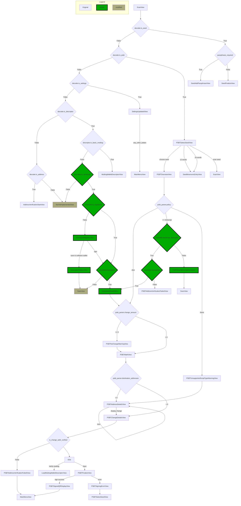

### ScanView

```mermaid
graph TB
classDef add fill:#00aa00, stroke:#000000,stroke-width:4px;
classDef modify fill:#aaaa7f;

subgraph  Legend 
    direction BT

    L1[Original]
    L2[Added]
    L2:::add
    L3[modified]
    L3:::modify
end


A[ScanView] --> T1{decoder.is_seed}
T1 -- False --> T2{decoder.is_psbt}
T2 -- False --> T3{decoder.is_settings}
T3 -- False --> T4{decoder.is_descriptor}
T4 -- False --> T5{decoder.is_address}
T5 -- True --> V50[AddressVerificationStartView]
T5 -- False --> V99[NotYetImplementedView]

T1 -- True --> T10{passphrase_required}
T10 -- True --> V10[SeedAddPassphraseView]
T10 -- False --> V11[SeedFinalizeView]

T3 -- True --> V30[SettingsUpdatedView]
V30 -- any_other_button ---> V32[MainMenuView]


T4 -- True --> T40{descriptor.is_basic_multisig}
T40 -- False --> T41{descriptor.is_miniscript} -- False --> V99[NotYetImplementedView]
T41:::add -- True --> T42{"descriptor.is_registered"} 
T42:::add -- False --> V43[DescriptorRegisterView]
T42:::add -- True --> T410{"descriptor.owns(psbt)"} 

V43:::add
V43 -- save to software wallet --> V44[DescriptorDisplayView] --> AAA
V43 -- sign --> T410
T410:::add -- False --> AAA[ScanView]
T410 -- True --> V202
V44:::add

AAA:::modify

V99:::modify
T40 -- True --> V42[MultisigWalletDescriptorView]

T2 -- True --> V20[PSBTSelectSeedView]

V20 -- "choose seed" --> V21[PSBTOverviewView]
V20 -- "12 words" --> V22[SeedMnemonicEntryView]
V20 -- "24 words" --> V22[SeedMnemonicEntryView]
V20 -- "scan seed" --> AA[ScanView]
V21 --> T20
T20 -- else --> T21{psbt_parser.change_amount} -- == 0 ---> V212[PSBTNoChangeWarningView]
T20 -- == miniscript --> T200{"controller.miniscript_descriptor"} 
T200:::add -- True --> T201{"descriptor.owns(psbt)"} 
T200 -- False --> V203[PSBTScanMiniscriptDescriptor]
V203:::add --> V2030[ScanView]


T201:::add
V202:::add
T201 -- True --> V202[DescriptorShowPolicy] --> T21
T201 -- False --> V2160[PSBTAddressVerificationFailedView]


T20{"psbt_parser.policy"} -- None ----> V211[PSBTUnsupportedScriptTypeWarningView]

T21 -- > 0  --> V213

V211  --> V214[PSBTAddressDetailsView]
V214 -- next --> V214
V214 -- display change --> V215
V212   --> V213[PSBTMathView]

V213 --> T210{psbt_parser.destination_addresses} 
T210 -- > 0 --> V214
T210 -- = 0 --> V215[PSBTChangeDetailsView]


V215 --> T22{is_change_addr_verified}
T22 -- False --> V216[PSBTAddressVerificationFailedView] ---> V0[MainMenuView]
T22 --> T220["Else"]
T220 -- Verify multisig --> V218[LoadMultisigWalletDescriptorView]
T220 -- Next --> V217[PSBTFinalizeView]
V217 -- sign success --> V220[PSBTSignedQRDisplayView] --> V0
V217 -- error --> V219[PSBTSigningErrorView] --> V200[PSBTSelectSeedView] 


    


    

```

