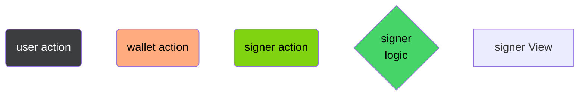
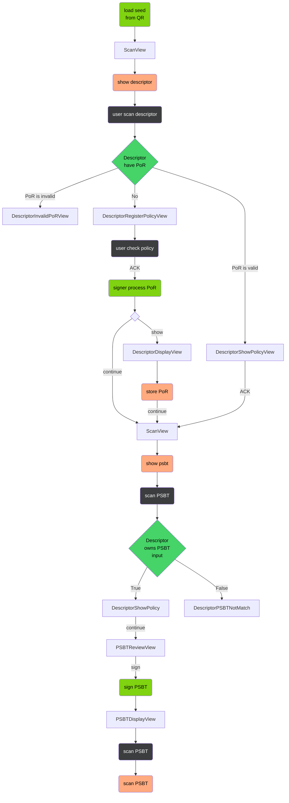

```mermaid
graph TB
classDef user fill:#3c3d3e, color:#fff;
classDef test fill:#46d367, color:#000;
classDef signer fill:#7fd310, color:#000;
classDef wallet fill:#ffaa7f, color:#000;

L1(user action)
L1:::user

L2(wallet action)
L2:::wallet

L3(signer action)
L3:::signer

L4{signer\nlogic}
L4:::test

L5[signer View]

```

```mermaid
graph TB
classDef user fill:#3c3d3e, color:#fff;
classDef test fill:#46d367, color:#000;
classDef signer fill:#7fd310, color:#000;
classDef wallet fill:#ffaa7f, color:#000;


    
S0(load seed\n from QR)
S0:::signer -->

V1[ScanView] --> 

W1(show descriptor)
W1:::wallet -->

U1(user scan descriptor)
U1:::user -->

T1{Descriptor\n have PoR}
T1:::test

T1 -- PoR is invalid --> V3[DescriptorInvalidPoRView]


T1 -- PoR is valid --> V4

T1 -- No --> V2[DescriptorRegisterPolicyView]
    V2 --> U2(user check policy)
    U2:::user

        U2 -- ACK --> 
        
        S1(signer process PoR)
        S1:::signer -->
        
        T2{ }
                
            T2 -- continue --> V01
            
            T2 -- show --> 
                V6[DescriptorDisplayView] --> 
                
                W2(store PoR)
                W2:::wallet 
                
                W2 -- continue --> V01

V4[DescriptorShowPolicyView] -- ACK ---> 

V01[ScanView]  --> 

W3(show psbt)
W3:::wallet -->

U3:::user
U3(scan PSBT) --> 

T3{Descriptor\n owns PSBT\n input}
T3:::test

T3 -- True --> V7
T3 -- False --> V07[DescriptorPSBTNotMatch]


V7[DescriptorShowPolicy] -- continue -->

V8[PSBTReviewView] -- sign -->

S2(sign PSBT)
S2:::signer -->

V9[PSBTDisplayView] -->

U4(scan PSBT)
U4:::user -->

W4(scan PSBT)
W4:::wallet

```

